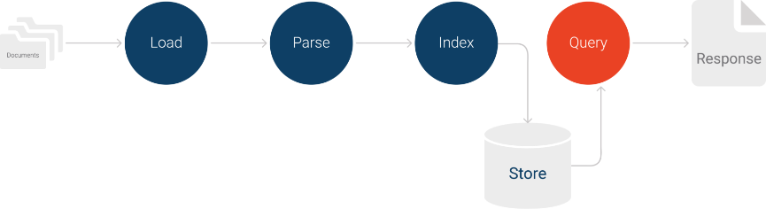

# Semantic Spotter - RAG Insurance Assistant - Upgrad-IIIT Bangalore Assignment
Easily find the information you need in your insurance documents with our simplified query system, built using RAG, Llama-Index, and OpenAI's GPT models

---

## About the Assignment
Deciphering insurance documents can be a frustrating and time-consuming process. The RAG Insurance Assistant offers a solution by using **Retrieval-Augmented Generation (RAG)** powered by **LlamaIndex**. This technology efficiently retrieves relevant information from policy documents, claim guidelines, and legal texts, then uses advanced AI models like GPT-4 or Gemini to provide clear, concise answers to user queries.

Key Benefits:
- **Streamlined Information Access**: Forget endless searches—ask specific questions and receive precise, concise answers instantly.
- **Enhanced Contextual Understanding**: Breaks down complex legal language into user-friendly explanations.
- **Powerful Scalability**: Handles large datasets effortlessly, making it suitable for both personal and enterprise-level applications.

Whether you're a policyholder seeking clarity on coverage or an insurance agent streamlining customer service, the RAG Insurance Assistant transforms the way users interact with complex insurance documents.

Example Use Cases:
- "What are the benefits of HDFC Sampoorna-Jeevan insurance?"
- "What will happen if premium not paid on time for HDFC Surgicare Plan ?"
- "Is there any age limit for HDFC Life Smart pension Plan ?"
- "Is blindness covered in HDFC Life Easy Health Policy ?"
- "What is the timeline to cancel HDFC Life Sanchay Plus Life Long Income Option plan, in case of any dissatisfaction ?"

---

## Key Features
-  **Fast, Relevant Information Retrieval**: LlamaIndex ensures quick access to the most relevant sections of insurance documents, providing precise answers tailored to user queries.
-  **Contextually Accurate Answers**: Advanced retrievers combined with AI language models (GPT-4 or Gemini) generate natural-language responses that understand the context of complex insurance policies.
-  **Scalable Performance with Vector Stores**: It enables fast and scalable performance, even with large datasets, by efficiently storing and querying embeddings.
-  **Document Agnostic**: Processes various document types, including PDFs, Word files, and text files, making it adaptable to any insurance material.
-  **Flexible Chunking Strategies**: Employs customizable document chunking methods, including overlapping techniques, to optimize retrieval accuracy and avoid information gaps.
-  **Cloud or Local Deployment**: Fully adaptable to your infrastructure needs—deploy locally for personal use or on the cloud for enterprise applications.
-  **Secure Access**: Ensures data privacy by handling sensitive insurance data with secure API key management and controlled access.
-  **Analytics-Ready**: Optionally integrates with analytics tools to track query patterns and optimize document updates or user experience.
-  **Easy-to-Use Conversational Interface:**: Provides a simple, conversational way to ask policy questions, eliminating the need to read through lengthy documents.
-  **Adaptable to Future Needs**: Designed for extensibility, easily supporting additional domains beyond insurance, such as legal or healthcare.

---

## System Design

-  **Data Loading**: SimpleDirectoryReader loads documents (including PDFs) from a directory. No explicit PyPDFLoader is needed, as Llama Index handles it internally.
-  **Indexing**: VectorStoreIndex creates the vector index. The service context is initialized with the LLM and embedding model.
-  **Storage**: StorageContext manages index persistence. The example shows how to load and save the index to disk, effectively providing caching.
-  **Querying**: RetrieverQueryEngine() creates a query engine. 
-  **Citations**: Llama Index directly provides source nodes with metadata (filename, page number if available). The code formats the response to include these citations.
-  **LLM and Embeddings**: The code explicitly sets the LLM (gpt-3.5-turbo) and embedding model (HuggingFaceEmbedding(model_name="BAAI/bge-small-en-v1.5")).
-  **Service Context**: The ServiceContext bundles the LLM and embedding model for use throughout the Llama Index pipeline.
-  **Caching**: The create_or_load_index function handles loading the index from disk if it exists, implementing the caching mechanism and improving the performance.

---

## Tech Stack
- **Language**: Python-In Jupyter Notebook
- **Frameworks/Libraries**: Transformers, PyPDF, Llama-Index, Disk Cache
- **APIs/Models**: OpenAI's GPT-3.5 
- **Tools used**: Jupyter Notebook

---

## Getting Started

### Prerequisites
Ensure you have the following installed:
- Python Latest version

### Installation
1. Clone the repo:
git clone https://github.com/dipaksah20/Semantic-Spotter-Using-Llama-Index/tree/main

2. Run the main file from Jupyter environment:
"Semantic_spotter_lamaindex_Sandeep.ipynb"

- Please note: OpenAI API keys are required for the project to function. You can obtain them from the OpenAI website and change the same in the code. We have updated the code and added more models to make it more dynamic in V2 of the project.

---

## Documentation
No documentation will be made available for this project since this project only uses technologies that already have their own documentation. Please refer to the following links for more information:

- [OpenAI](https://platform.openai.com/docs/)
- [Llama-Index](https://www.llamaindex.ai/)

---

## Challenges/Issues Faced with fixes

- [Issue #1](Cache layer was added to prevent re-embedding of the data. This was done to  make the retrieval process more efficient.)

- [Issue #2](Vector index generation was stored in the local storage to avoid regeneration and stored vector index is used everytime we ran the solution.)

---

##  Future Improvements
- [ ] Add more selectable GPT models to the project(Gemini, Claude AI, Huggingface models etc).
- [ ] Add more features to the project.
- [ ] Add more selectable Vector Store to the project(Pinecone, Weaviate etc).

---

## Contact
For any queries or feedback, feel free to reach out:

- **Email**: dipaksah@gmail.com
- **GitHub**: https://github.com/dipaksah20

---